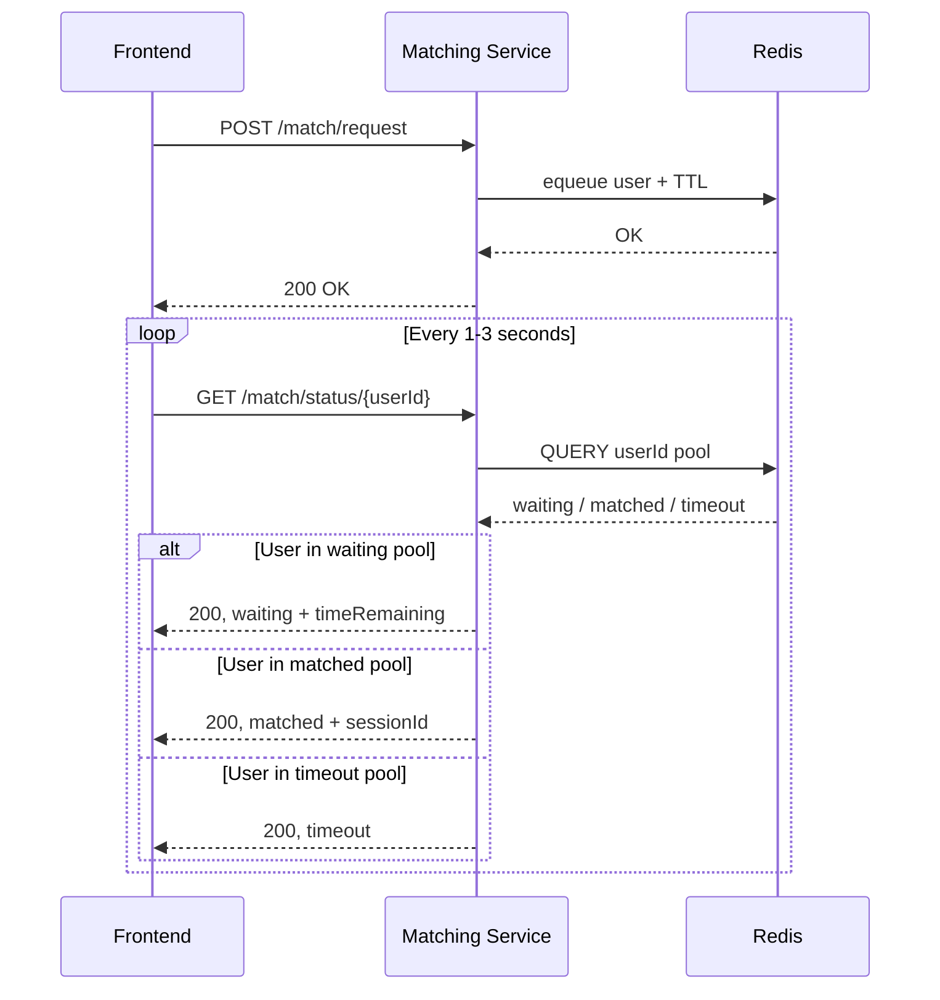
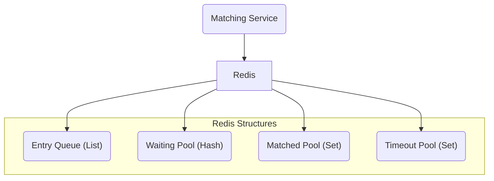

## Matchmaking Flow

The following sequence diagram shows the sequence for the endpoints for the Matching Service:

The following component diagram shows the Redis structures used by the Matching Service:

