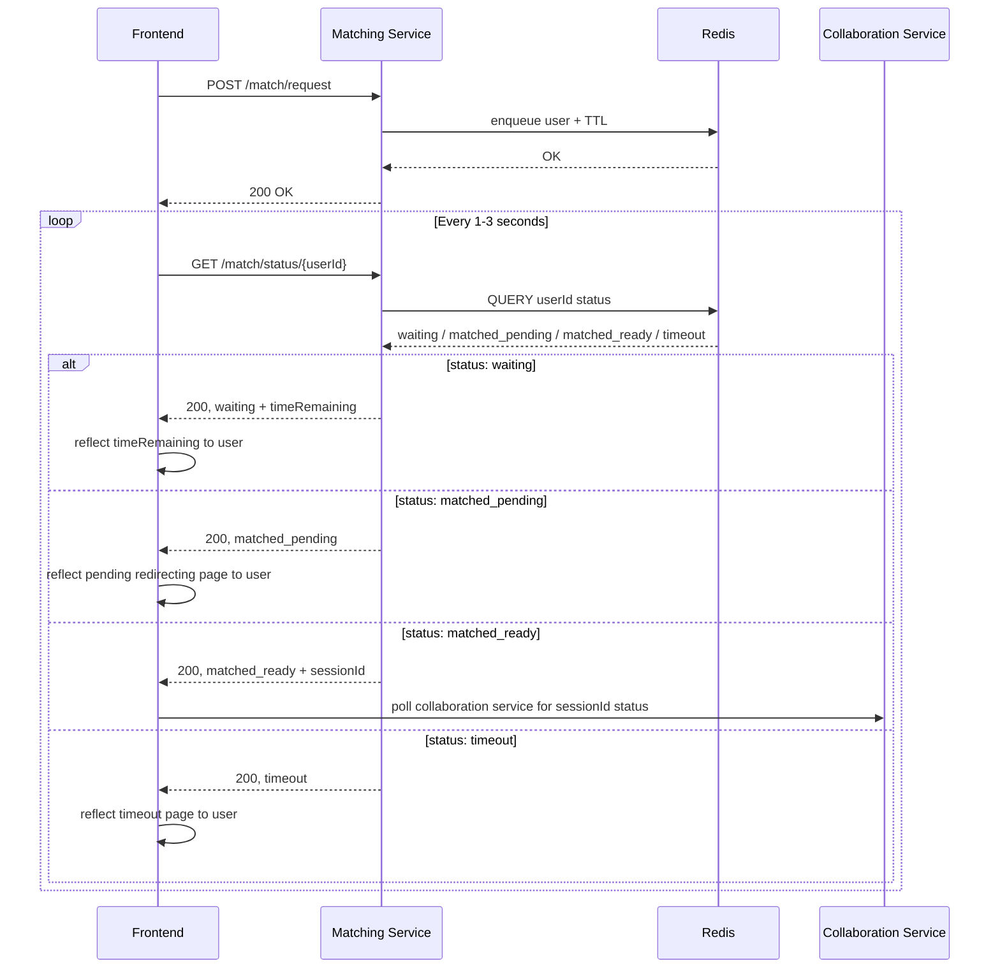

## Matchmaking Flow

The following sequence diagram shows the sequence for the endpoints for the Matching Service:

The following diagram shows the interactions between the Matching Service, Frontend and the Collaboration Service during `matched_ready` state:

