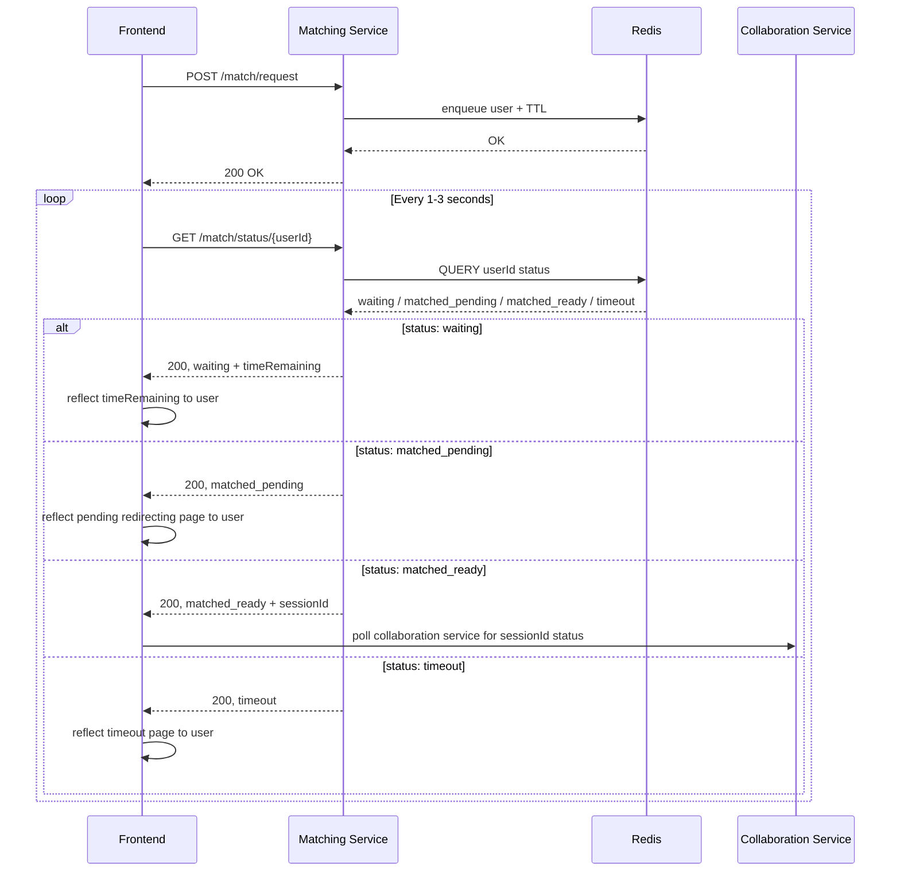
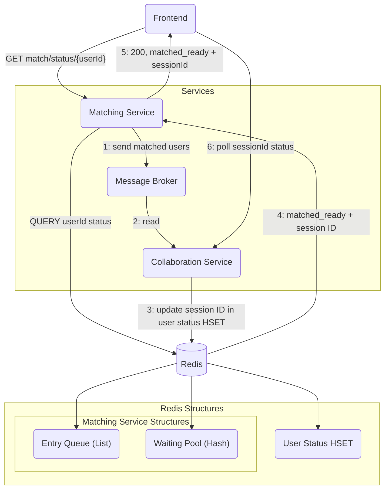

## Matchmaking Flow

The following sequence diagram shows the sequence for the endpoints for the Matching Service:



The following diagram shows the interactions between the Matching Service, Frontend and the Collaboration Service during `matched_ready` state:


## Matching Service Design Decisions

### Overview
The matching service is responsible for matching users based on some reasonable criteria (i.e. difficulty and topics). It ensures fair, **first-come-first-serve** matching, while handling timeouts, cancellations, and multiple concurrent, requests.

### Matching Criteria

Users will provide their preferences on the frontend before entering sending their match request to the matching service and entering the matching queue. The criteria they are supposed to select will include:

1. **Difficulty level:** 
    - Easy, Medium or Hard.
2. **Topics:**
    - Select one or multiple;
    - List of topics is provided by the Question Service.

When a user starts matching, the frontend will send a match request to the Matching Service:

**Endpoint:** `POST /match/request`

**Payload:**
```json
{
    "userId": "string",
    "difficulty": "Easy | Medium | Hard",
    "topics": [
        "string"
    ],
}
```

#### Matching Guidelines

1. Only users will the **same difficulty level** are considered for matching.
2. Users must share **at least one common topic** to be considered a potential match.

### Matching Algorithm

#### Redis Components

The following are the data structures in Redis used by the matching service:

1. **`entry_queue`**: Receives match requests from the frontend. The service pops from this queue.
2. **`stutus_hset`**: Stores users currently in the service, along with their status (`waiting`, `matched`, `timeout`), metadata (`difficulty`, `topics`), and `last_seen` timestamp.
3. **`matching_pool` — nested strcuture `difficulty -> topic -> queue(userId)`**: Unmatched users are added to these topic-based queues.
4. **`fcfs_queue`**: Global queue tracking unmatched users for first-come-first-serve matching.

#### Matching Flow

1. **Match Request**
    - Frontend sends `POST /match/request` with `userId`, `difficulty` and `topics` to matching service.
    - Matching service adds the user to `stutus_hset` with:
        - `status = waiting`
        - TTL = 10 minutes
        - `last_seen = now`
    - `userId` is pushed to entry queue.
    - *If the user already exists in `status_hset`, the match request is rejected.*

2. **Finding a Match**
    - Matching service pops `userId` from the `entry_queue` and attempts to match that user.
    - Matching service will check `matching_pool[difficulty][topic]` queues and get a set of potential matches, `potential_matches`.
        - If `potential_matches` is empty (i.e. no match), add the user to relevant queues in the `matching_pool` and the `fcfs_queue`.
    - If there are one or more users in `potential_matches`, pick the earliest user in `fcfs_queue` and pair them.
    - Update both user's statuses in `stutus_hset` to `matched` and remove the users from all queues. Users TTL is also cancelled.
    - Generate the `matching_id` with the relevant `difficulty` and `topics` (include all topics that overlap for both users) and send the information to Collaboration Service.

3. **Frontend Polling**
    - Frontend continuously polls for user status in the `status_hset` and updates the user on the time remaining for matching.
    - On `matched`, redirects the user to a loading page and polls Collaboration Service for a `session_id`.

### Edge Cases

#### Cancelling Match 

`DELETE /match/cancel/{user_id}` removes users from all queues and HSETs only if the status is `waiting`. Cancelling after being matched if not allowed to avoid race conditions.

#### Timeout

TTL of 10 minutes is set for users entering the matching service. On expiry, status of user is updated to `timeout` and removed from all queues. A short TTL of 10 seconds after timeout is then set to allow frontend to poll before user is fully deleted.

#### Multiple Requests

If the user already exists in `status_hset`, reject new match requests.

#### User Disconnects

Each poll from the frontend will update a `last_seen` timestamp in `status_hset`. Matching service will run a periodic cleanup job, if `now - last_seen > threshold` (~ 30 seconds), remove the user from all queues and HSETs.

### Race Conditions

There will be three main processes running concurrently in the matching service:

- `MatchingWorker`: Processes match requests in FCFS order and pairs the users based on matching criteria.
- `CleanUpJob`: Periodically scans `status_hset` to detect users who have disconnected.
- `TTLHandler`: Handles users whose TTL expires naturally (i.e. no clean up or match)

Concurrency issues may occur due to multiple processes touching the same Redis data structure (`matching_pool`, `fcfs_queue`, `status_hset`).

Therefore, current solutions will include:

1. `TTLHandler` and `CleanUpJob` should always check `status_hset` before removing users, and only remove users whom `status = waiting`.
2. Redis Lua scripts to ensure atomic removal and status updates.

### Other TODOs
- handle disconnection of partner when matched
- handle no question assignable
