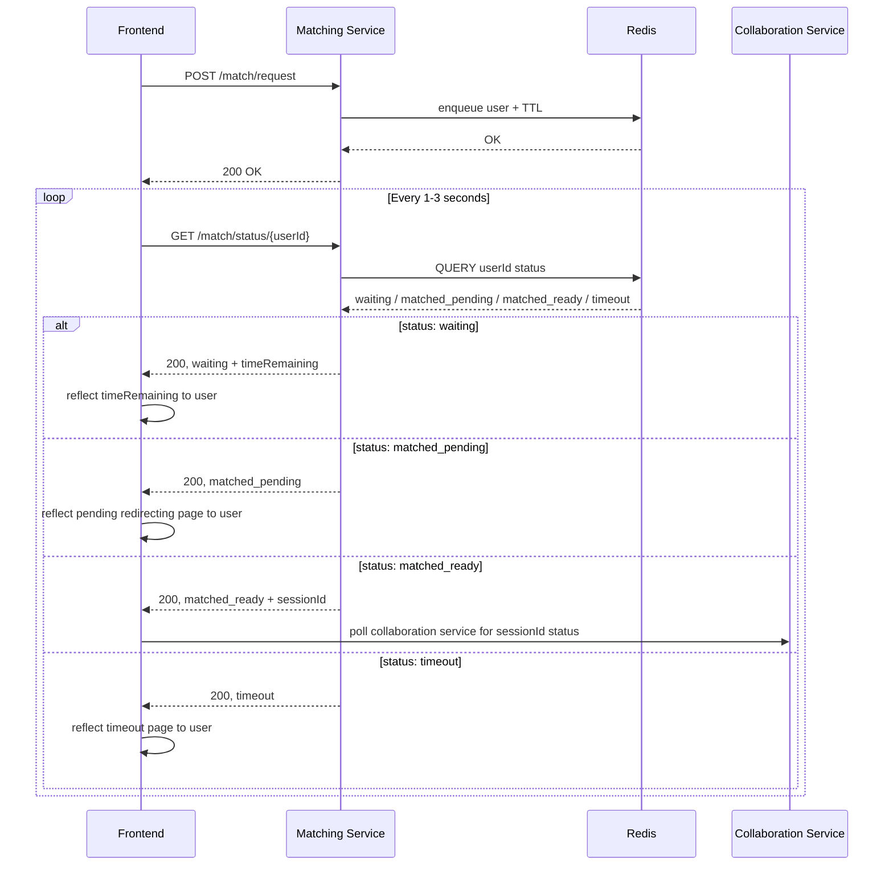
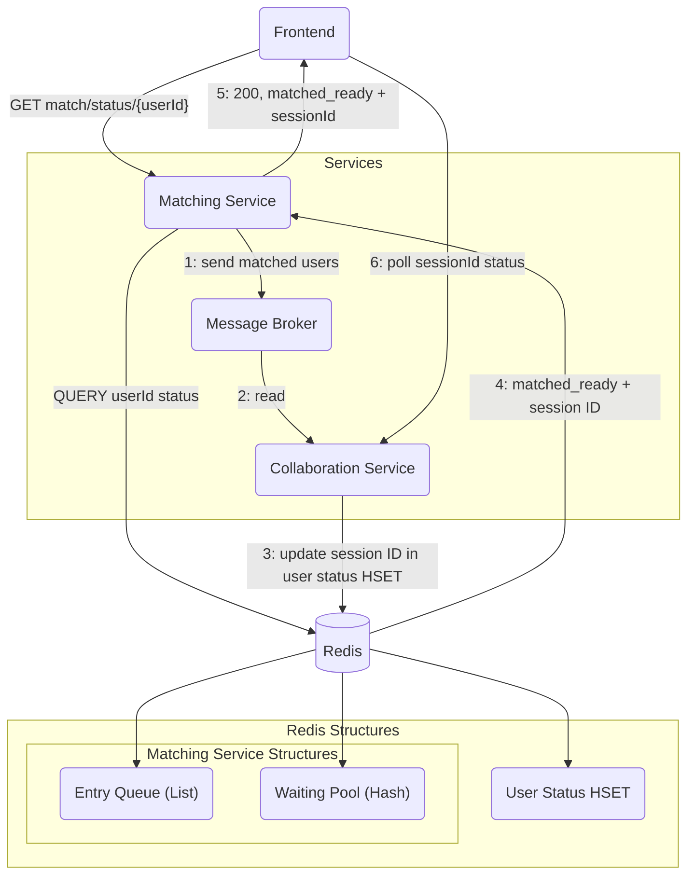

## Matchmaking Flow

The following sequence diagram shows the sequence for the endpoints for the Matching Service:



The following diagram shows the interactions between the Matching Service, Frontend and the Collaboration Service during `matched_ready` state:



## Matching Service Design Decisions

### Overview

The matching service is responsible for matching users based on some reasonable criteria (i.e. difficulty and topics). It ensures fair, **first-come-first-serve** matching, while handling timeouts, cancellations, and multiple concurrent, requests.

It operates user Redis-based data structures and a single matching worker that processes queued jobs sequentially.

### Matching Criteria

Users will provide their preferences on the frontend before entering sending their match request to the matching service and entering the matching queue. The criteria they are supposed to select will include:

1. **Difficulty level:**
   - Easy, Medium or Hard.
2. **Topics:**
   - Select one or multiple;
   - List of topics is provided by the Question Service.

When a user starts matching, the frontend will send a match request to the Matching Service:

**Endpoint:** `POST /match/request`

**Payload:**

```json
{
  "userId": "string",
  "difficulty": "Easy | Medium | Hard",
  "topics": ["string"]
}
```

#### Matching Guidelines

1. Only users will the **same difficulty level** are considered for matching.
2. Users must share **at least one common topic** to be considered a potential match.

### Matching Algorithm

#### Redis Components

The following are the data structures in Redis used by the matching service:

| **Structure**                          | **Type**     | **Purpose**                                                                                                                        |
| -------------------------------------- | ------------ | ---------------------------------------------------------------------------------------------------------------------------------- |
| `status_hset:${userId}`                | Hash Set     | Contains metadata and lifecycle state for each user(`status`, `joinedTimestamp`, `difficulty`, `topics`, `lastSeen`, `matchingId`) |
| `user_ttl:${userId}`                   | Key          | Time-to-live (TTL) for the user's matching session (10 minutes)                                                                    |
| `matching_pool:${difficulty}:${topic}` | Lists/Queues | Queues of users waiting for a match (each entry includes `userId`, `joinedTimestamp`)                                              |
| `fcfs_list`                            | List         | Tracks global user arrival order(for FCFS matching)                                                                                |
| `entry_queue`                          | Queue        | Sequential job queue for Matching Worker (`clear_user` or `match_user`)                                                            |

#### Matching Flow

1. **Match Request**
   - Frontend sends `POST /match/request` with `userId`, `difficulty` and `topics` to matching service.
   - Matching service adds the user to `stutus_hset` with:
     - `status = waiting`
     - `difficulty = 'Easy' | 'Medium' | 'Hard'`
     - `topics` (_list of chosen topics_)
     - `last_seen = now`
     - `joinedTimestamp = now`
   - New job of `{ 'match_user', 'userId' }` is pushed into `entry_queue`.
   - _If the user already exists in `status_hset`, the match request is rejected._

2. **Job Queue Handling**
   - The Matching Worker continuously consumes jobs from the `entry_queue`. The jobs can be of two types:
   - Job to match users:

   ```
   {
       job: 'match_user';
       userId : string;
       userData: HashData;
   }
   ```

   - Job to clear users from `matching_pool`:

   ```
   {
       job: 'clear_user';
       userId: string;
       userData: HashData;
   }
   ```

   _`HashData` contains all the data found in the hash set_

3. **Clearing a User**
   - Removes `userId` from:
     - `matching_pool`
     - `fcfs_list`
   - _Verifies that it is removing the right data by comparing the `joinedTimestamp`_

4. **Matching a User**
   - Matching Worker pops `userId` from the `entry_queue` and attempts to match that user.
   - Matching Worker will first check the eligibility of the user (i.e. whether it should handle the user): - `status == waiting`. - User not disconnected/cancelled. - `joinedTimestamp` matches the one in the job. - TTL > 10 seconds remaining (to ensure enough time to complete matching job).
     If valid, sets the user's `status = 'matching'` and attempts to find a match.
   - Matching service will check `matching_pool[difficulty][topic]` queues and get a set of potential matches, `potential_matches`.
     - If `potential_matches` is empty (i.e. no match), add the user to relevant queues in the `matching_pool` and the `fcfs_queue`.
   - If there are one or more users in `potential_matches`, pick the earliest user in `fcfs_queue` and pair them if a `questionId` can be returned for their list of common topics.
   - For matched users, update both user's statuses in `stutus_hset` to `matched` and remove the users from all queues. Users TTL is also cancelled.
   - Generate the `matching_id` with the relevant `difficulty` and `topics` (include all topics that overlap for both users) and send the information to Collaboration Service.

5. **Frontend Polling**
   - Frontend continuously polls for user status in the `status_hset` and updates the user on the time remaining for matching.
   - On `matched`, redirects the user to a loading page and polls Collaboration Service for a `session_id`.

### Edge Cases

#### Cancelling Match

`DELETE /match/cancel/{user_id}` sets the user's status to `'cancelled`', extends the user's TTL by 1 minute, and enqueues a `clear_user` job for the Matching Worker.

#### Timeout

TTL of 10 minutes is set for users entering the matching service. On expiry, status of user is updated to `timeout` and a `clear_user` job is queued for the Matching Worker. A short TTL of 1 minute after timeout is then set to allow frontend to poll before user is fully deleted.

#### Multiple Requests

If the `userId` already exists in `status_hset`, reject new match requests.

#### User Disconnects

Each poll from the frontend will update a `last_seen` timestamp in `status_hset`. Matching service will run a periodic cleanup job, if `now - lastSeen > threshold` (~ 30 seconds): - Set user status to `'disconnected'`, - queue a `clear_user` job for the Matching Worker - extend user's TTL by 1 minute

### Workers

There are 3 main workers in the Matching Service:

1. **Matching Worker**
   - Handles `clear_user` and `match_user` jobs
   - Only worker that can delete data from the `matching_pool`, `fcfs_list` and `entry_queue`
   - Reads and updates the `status_hash` (i.e. sets status to disconnected if any disconnect detected)

2. **TTLHandler**
   - Listens to TTL expiry events
   - If alerted of a TTL expiry, if user's current `status == waiting`, sets status to `'timeout'` and extends the TTL by 1 minute (to give the frontend time to poll for the status). Then, enqueues a `clear_user` job for the Matching Worker.
   - Else, if `status == 'matching'`, extends TTL by 1 minute to give Matching Worker time to complete matching job.
   - Else, if `status == 'matched' | 'disconnected' | 'cancelled' | 'timeout'`, delete the user's entry from `status_hash`

3. **DisconnectSweeper**
   - Sweeps through the `status_hash` every 10 seconds
   - For users whose `status == 'waiting'`, check `Date.now() - lastSeen > DISCONNECT_THRESHOLD`. If it is, set status to `disconnect`, extend user's TTL by 1 minute, enqueue a `clear_user` job.
