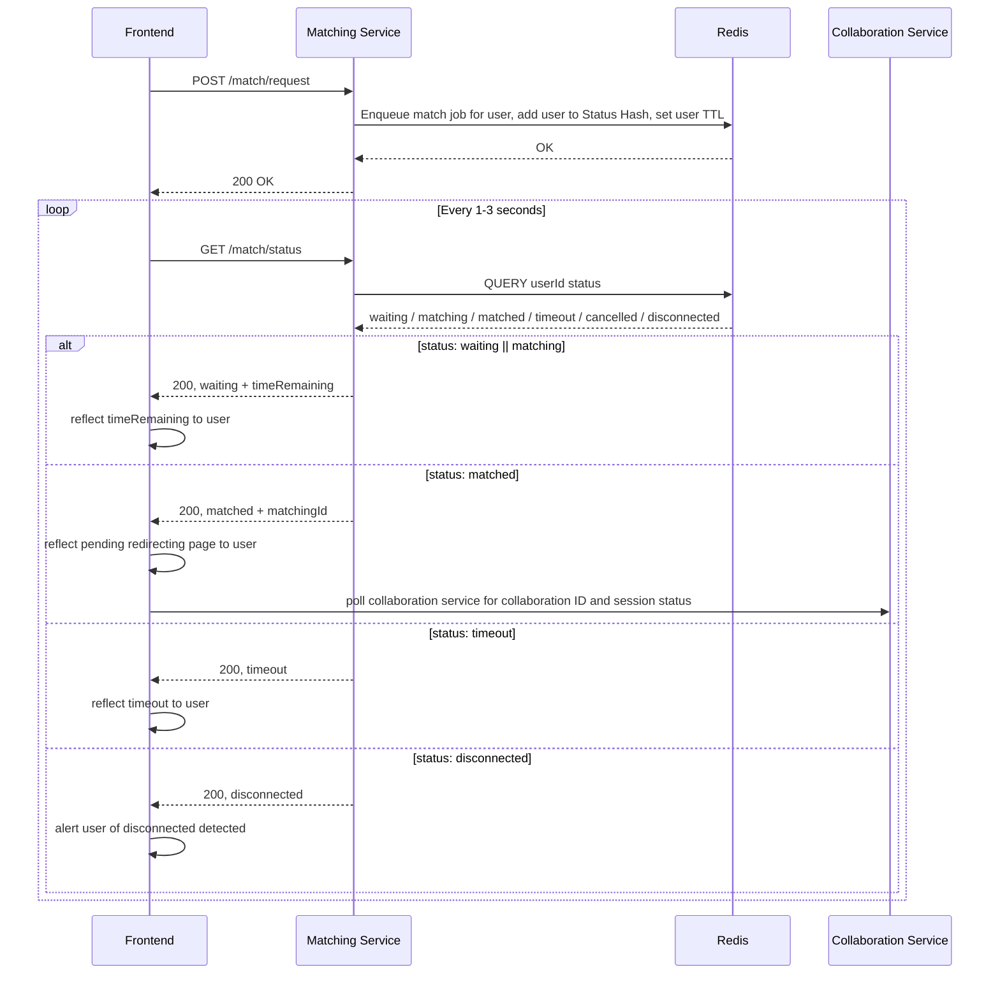
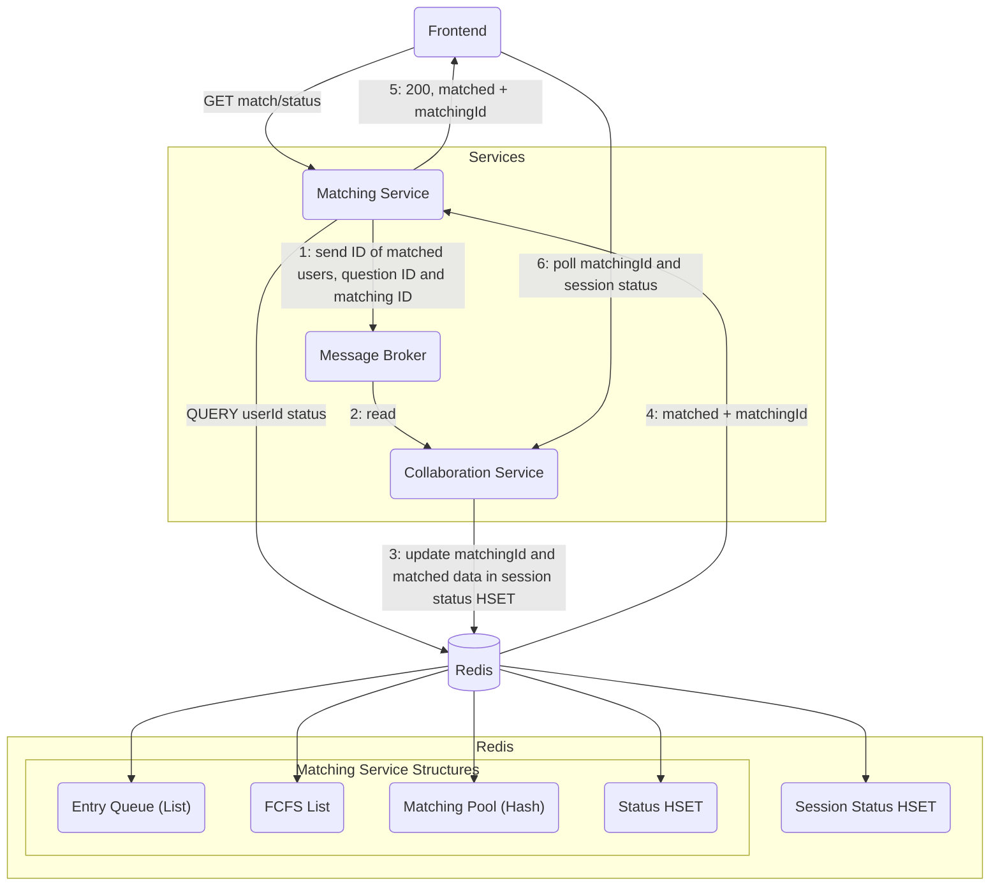

## Matchmaking Flow

The following sequence diagram shows the sequence for the endpoints for the Matching Service:



The following diagram shows the interactions between the Matching Service, Frontend and the Collaboration Service during `matched` state:



## Matching Service Design Decisions

### Overview

The Matching Service is responsible for matching users based on some reasonable criteria (i.e. difficulty and topics). It ensures fair, **first-come-first-serve** matching, while handling timeouts, cancellations, and multiple concurrent, requests.

The Matching Service runs on Redis-based data structures and 3 main workers:

- Matching Worker: executes main logic,
- Disconnect Sweeper: detects disconnected users,
- TTL Handler: handles user TTL expirations (timeouts)

### Matching Criteria

Users will provide their preferences on the frontend before sending their match request to the matching service and entering the matching service. The criteria they are supposed to select will include:

1. **Difficulty level:**
   - Select one;
   - Easy, Medium or Hard.
2. **Topics:**
   - Select one or multiple;
   - List of topics is provided by the Question Service.

When a user starts matching, the frontend will send a match request to the Matching Service:

**Endpoint:** `POST /match/request`

**Payload:**

```json
{
  "difficulty": "Easy" | "Medium"| "Hard",
  "topics": ["array", "algorithms"]
}
```

#### Matching Guidelines

1. Only users will the **same difficulty level** are considered for matching.
2. Users must share **at least one common topic** to be considered a potential match.

### Matching Algorithm

#### Redis Components

The following are the data structures in Redis used by the matching service:

| **Structure**                          | **Type**     | **Purpose**                                                                                                                        |
| -------------------------------------- | ------------ | ---------------------------------------------------------------------------------------------------------------------------------- |
| `status_hset:${userId}`                | Hash Set     | Contains metadata and lifecycle state for each user(`status`, `joinedTimestamp`, `difficulty`, `topics`, `lastSeen`, `matchingId`) |
| `user_ttl:${userId}`                   | Key          | Time-to-live (TTL) for the user's matching session (10 minutes)                                                                    |
| `matching_pool:${difficulty}:${topic}` | Lists/Queues | Queues of users waiting for a match (each entry includes `userId`, `joinedTimestamp`)                                              |
| `fcfs_list`                            | List         | Tracks global user arrival order(for FCFS matching)                                                                                |
| `entry_queue`                          | Queue        | Sequential job queue for Matching Worker (`clear_user` or `match_user` jobs)                                                       |

#### Matching Flow

1. **Match Request**
   - Frontend sends `POST /match/request` with `difficulty` and `topics` to matching service (_userId is obtained from user token_),
   - Matching service adds the user to `stutus_hset` with:
     - `status = waiting`
     - `difficulty = 'Easy' | 'Medium' | 'Hard'`
     - `topics` (_list of chosen topics_)
     - `lastSeen = now`
     - `sessionKey = now`
   - New job of `{ 'match_user', userId, sessionKey }` is pushed into `entry_queue`.
   - _`sessionKey` is allocated to ensure data being used across the matching service is not outdated_
   - _If the user already exists in `status_hset`, the match request is rejected._

2. **Job Queue Handling**
   - The Matching Worker continuously consumes jobs from the `entry_queue`. The jobs can be of two types:
   - Job to match users:

   ```
   {
       job: 'match_user';
       userId : string;
       sessionKey: number;
   }
   ```

   - Job to clear users from `matching_pool`:

   ```
   {
       job: 'clear_user';
       userId: string;
       sessionKey: number;
       userData: HashData;
   }
   ```

   _`HashData` contains all the data found in the hash set_

3. **Clearing a User**
   - Removes `userId` from:
     - `matching_pool`
     - `fcfs_list`
   - _Verifies that it is removing the right data by comparing the `sessionKey`_

4. **Matching a User**
   - Matching Worker handles the match job for one user at a time.
   - Matching Worker will first check the eligibility of the user (i.e. whether it should handle the user):
     - `status == waiting`.
     - User not disconnected/cancelled.
     - `sessionKey` matches the one in the job. _(if it doesn't, job is outdated.)_
     - TTL > 10 seconds remaining (to ensure enough time to complete matching job).

     _If valid, sets the user's `status = 'matching'` and attempts to find a match._

   - Matching service will check `matching_pool[difficulty][topic]` queues and get a set of potential matches, `potential_matches` (potential matched are verified for eligibility (i.e. `status == waiting`, `sessionKey` matches Status Hash))
     - If `potential_matches` is empty (i.e. no match), add the user to relevant queues in the `matching_pool` and the `fcfs_queue`.
   - If there are one or more users in `potential_matches`, pick the earliest user in `fcfs_queue` and pair them if a `questionId` can be returned for their list of common topics.
   - For matched users:
     - update both user's statuses in `stutus_hset` to `matched` and update the `matchingId` field in `status_hash`
     - Remove the users from `matching_pool` and `fcfs_list`
     - Reset TTL to 60 seconds (to give time to frontend to poll for updated status and `matchingId`)
     - Send the match information (i.e. `userId`s of both user, `matchingId` and `questionId`) to the Collaboration Service via Redis and a Messege Broker.

5. **Frontend Polling**
   - Frontend continuously polls for user status in the `status_hset` and updates the user on the time remaining for matching.
   - On `matched`, redirects the user to a loading page and polls Collaboration Service for a `sessionId` and the session status.

### Edge Cases

#### Cancelling Match

`DELETE /match/cancel` sets the user's status to `'cancelled`', extends the user's TTL by 1 minute, and enqueues a `clear_user` job for the Matching Worker.

#### Timeout

TTL of 10 minutes is set for users entering the matching service. On expiry, status of user is updated to `timeout` and a `clear_user` job is queued for the Matching Worker. A short TTL of 1 minute after timeout is then set to allow frontend to poll before user is fully deleted.

#### Multiple Requests

If the `userId` already exists in `status_hset`, reject new match requests.

#### User Disconnects

Each poll from the frontend will update a `lastSeen` timestamp in `status_hset`. Matching service will run a periodic cleanup job via a worker, Disconnect Sweeper. If `now - lastSeen > threshold` (~ 30 seconds):

- Set user status to `'disconnected'`,
- queue a `clear_user` job for the Matching Worker, and
- extend user's TTL by 1 minute (to give time to the Matching Worker to process the clear job).

### Workers

There are 3 main workers in the Matching Service:

1. **Matching Worker**
   - Handles `clear_user` and `match_user` jobs
   - Only worker that can delete data from the `matching_pool`, `fcfs_list` and `entry_queue`. This prevents any potential race conditions among the Redis data structures.
   - Reads and updates the `status_hash` (i.e. sets status to disconnected if any disconnect detected while matching, sets user status to `matching` when handling a match job).

2. **TTL Handler**
   - Listens to TTL expiry events
   - If alerted of a TTL expiry, if user's current `status == waiting`, sets status to `'timeout'` and extends the TTL by 1 minute (to give the frontend time to poll for the status). Then, enqueues a `clear_user` job for the Matching Worker.
   - Else, if `status == 'matching'`, extends TTL by 10 seconds to give Matching Worker time to complete matching job.
   - Else, if `status == 'matched' | 'disconnected' | 'cancelled' | 'timeout'`, delete the user's entry from `status_hash` (i.e. clear the user our of the service).
   - Only worker that can delete records from the `status_hash`

3. **Disconnect Sweeper**
   - Sweeps through the `status_hash` every 10 seconds
   - For users whose `status == 'waiting'`, check `Date.now() - lastSeen > DISCONNECT_THRESHOLD`. If it is, set status to `disconnect`, extend user's TTL by 1 minute, and enqueue a `clear_user` job.

## Project Structure

```
matching_service/
│
├─ src/
│   ├─ main.ts                    # Entry point of matching service
│   │
│   ├─ workers/                   # Main workers
│   │   ├─ matchingWorker.ts      # Main matching logic
│   │   ├─ ttlHandler.ts          # TTL cleanup logic
│   │   └─ disconnectSweeper.ts   # Detects disconnected users
│   │
│   ├─ api/
│   │   ├─ routes.ts              # Sets the endpoints
│   │   └─ server.ts              # Sets up the matching service server
│   │
│   ├─ clients/
│   │   ├─ messenger/
│   │   │   └─ messenger_client.ts  # Message broker
│   │   │
│   │   ├─ redis/
│   │   │   ├─ data_structures/
│   │   │   │   ├─ entry_queue.ts   # Entry Queue
│   │   │   │   ├─ fcfs_list.ts     # FCFS List
│   │   │   │   ├─ matching_pool.ts # Matching Pool
│   │   │   │   └─ status_hash.ts   # Status HSET
│   │   │   ├─ redis_client.ts      # Redis
│   │   │   ├─ ttl_subscriber.ts    # Subscribes to TTL expiration events
│   │   │   └─ types.ts
│   │   │
│   │   └─ question_service_client.ts
│   │
│   ├─ logger/
│   ├─ middleware/
│   └─ test-data/
│
├─ test/                            # Unit tests
├─ package.json
├─ tsconfig.json
├─ README.md
└─ .env
```

## Getting Started

First, install the dependencies:

```
npm install
```

Then run the development server:

```
npm run dev
```

To run unit tests:

```
npm run test
```
