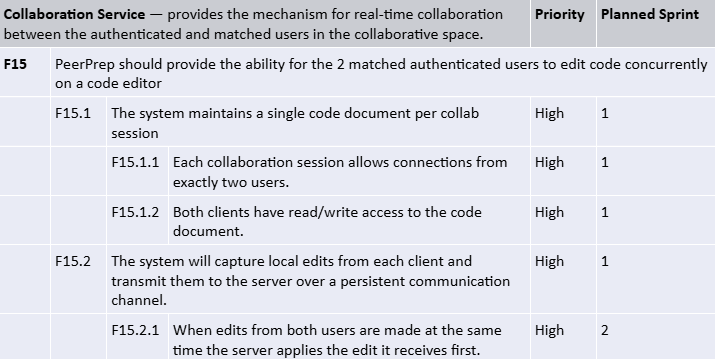

### Goal and Functional requirements



## Tech Stack:

YJS: for real time collaboration using CRDTs, ensures edits from multiple users merge smoothly without conflicts
Y-websockets: Maintain live, bidirectional communication between clients and the server
Monaco editor: something similar to visual studio code editor
y-postgres for persistence in doc states
node.js manage collaboration sessions and user awareness

### YJS-websocket

### Architectural Decisions

### Scalability and Compatibility

## Setup

Run the following:

```
cd frontend
npm install yjs y-websocket y-monaco @monaco-editor/react
```
